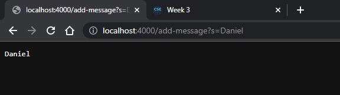
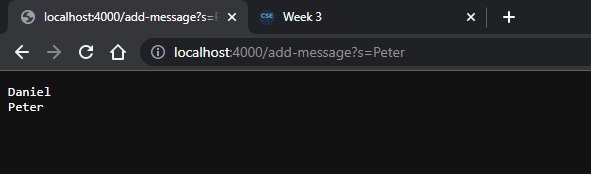
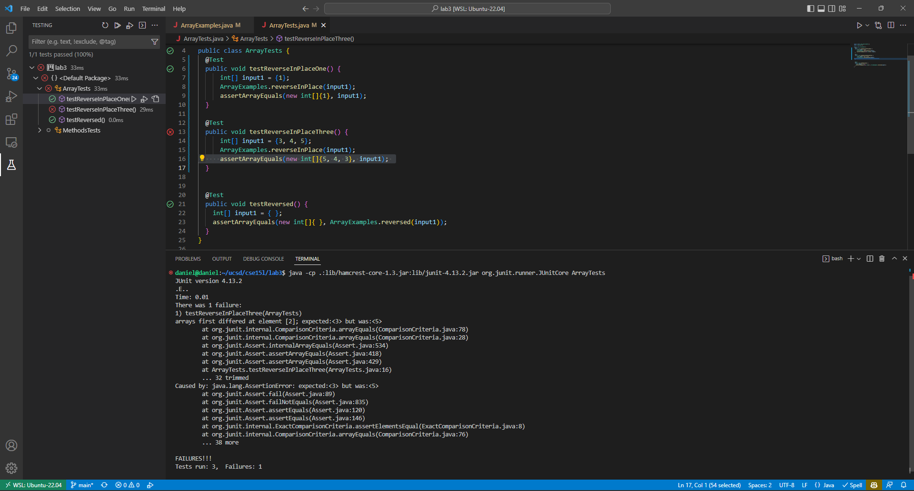

# CSE 15L, LAB 2

## Part 1

### StringServer.java Code
```java
import java.io.IOException;
import java.net.URI;

class StringHandler implements URLHandler {
    // all the messages that the Server will remember (in-memory)
    String message = "";

    public String handleRequest(URI url) {
        String path = url.getPath();
        
        if (url.getQuery() == null) {
            return message;
        }

        String[] parameters = url.getQuery().split("=");

        // add-message path
        if (path.contains("/add-message")) {
            // first parameter for the query type, second as the actual string to add
            if (parameters.length == 2 && parameters[0].equals("s")) {
                message += parameters[1] + "\n";
                return message;
            }
            return "400 Bad Request";
        }
        return "404 Not Found";
    }
}

class StringServer {
    public static void main(String[] args) throws IOException {
        if (args.length == 0) {
            System.out.println("Missing port number! Try any number between 1024 to 49151");
            return;
        }

        int port = Integer.parseInt(args[0]);

        Server.start(port, new StringHandler());
    }
}
```
Note: the following code snippet is not a screenshot, but instead Markdown with syntax highlighting. 

### StringServer Website Screenshot 1 


> Which methods in your code are called?

- The `handleRequest` method from the `StringHandler` class is called when the user sends a request to the `StringServer`. Within the method,
    - the `getPath` instance method of the `url` URI object is called to later check if the `/add-message` path is being hit.
    - the `getQuery` instance method of the `url` URI object is called to check if a query is being passed in and parse any query parameters for later use in adding a new message.

> What are the relevant arguments to those methods, and the values of any relevant fields of the class?

- `handleRequest`: 
    - Relevant argument: the `URI` object of the client request to `StringHandler`
    - Relevant fields & values:
        - `message`: String containing all the messages added via request, modified given that the `url` URI parameter is considered a valid request by following code. Value: `"Daniel\n"`

- `getPath`: 
    - Relevant argument: N/a
    - Relevant values: 
        - `message`: String containing all the messages added via request, modified given that the path contains `/add-message`. Value: `"Daniel\n"`

- `getQuery`: 
    - Relevant argument: N/a
    - Relevant values: 
        - `message`: String containing all the messages added via request, modified given that the query is `split` with delimiter `=` into two elements and the first element being the character `s`. Value: `"Daniel\n"`

> How do the values of any relevant fields of the class change from this specific request? If no values got changed, explain why.

The `message` variable of the `StringHandler` is modified from `""` to `"Daniel\n"`. 


### StringServer Website Screenshot 2 

> Which methods in your code are called?

- The `handleRequest` method from the `StringHandler` class is called when the user sends a request to the `StringServer`. Within the method,
    - the `getPath` instance method of the `url` URI object is called to later check if the `/add-message` path is being hit.
    - the `getQuery` instance method of the `url` URI object is called to check if a query is being passed in and parse any query parameters for later use in adding a new message.

> What are the relevant arguments to those methods, and the values of any relevant fields of the class?

- `handleRequest`: 
    - Relevant argument: the `URI` object of the client request to `StringHandler`
    - Relevant fields & values:
        - `message`: String containing all the messages added via request, modified given that the `url` URI parameter is considered a valid request by following code. Value: `"Daniel\nPeter\n"`

- `getPath`: 
    - Relevant argument: N/a
    - Relevant values: 
        - `message`: String containing all the messages added via request, modified given that the path contains `/add-message`. Value: `"Daniel\nPeter\n"`

- `getQuery`: 
    - Relevant argument: N/a
    - Relevant values: 
        - `message`: String containing all the messages added via request, modified given that the query is `split` with delimiter `=` into two elements and the first element being the character `s`. Value: `"Daniel\nPeter\n"`

> How do the values of any relevant fields of the class change from this specific request? If no values got changed, explain why.

The `message` variable of the `StringHandler` is modified from `"Daniel\n"` to `"Daniel\nPeter\n"`. 

## Part 2

### Bug in `reverseInPlace` method from `ArrayExamples.java`

> A failure-inducing input for the buggy program, as a JUnit test and any associated code
```java
@Test
public void testReverseInPlaceThree() {
    int[] input1 = {3, 4, 5};
    ArrayExamples.reverseInPlace(input1);
    assertArrayEquals(new int[]{5, 4, 3}, input1); 
}
```
Note: the following code snippet is not a screenshot, but instead Markdown with syntax highlighting. 

> An input that doesn’t induce a failure, as a JUnit test and any associated code

```java
@Test
public void testReverseInPlaceOne() {
    int[] input1 = {1};
    ArrayExamples.reverseInPlace(input1);
    assertArrayEquals(new int[]{1}, input1); 
}
```
Note: the following code snippet is not a screenshot, but instead Markdown with syntax highlighting. 

> The symptom, as the output of running the tests



> The bug, as the before-and-after code change required to fix it

Before:
```java
static void reverseInPlace(int[] arr) {
    for (int i = 0; i < arr.length; i += 1) {
        arr[i] = arr[arr.length - i - 1];
    }
}
```
Note: the following code snippet is not a screenshot, but instead Markdown with syntax highlighting. 

After: 
```java
static void reverseInPlace(int[] arr) {
    for (int i = 0; i < arr.length / 2; i += 1) {
        int temp = arr[i];
        arr[i] = arr[arr.length - i - 1];
        arr[arr.length - i - 1] = temp;
    }
}
```
Note: the following code snippet is not a screenshot, but instead Markdown with syntax highlighting. 

The failure inducing inputs made me realize that the `reverseInPlace` method was not actually reversing the array in place. Instead, it was mirroring the array in place. 

After taking a look at the method, I realized that the method would assign the first element to the last element, the second element to the second to last element, and so on. However, it would not assign the last element to the first element, the second to last element to the second element, and so on. So by half way through the array, the first half of the array would be a mirror of the second half of the array. As it finished the second half of the array iteration, it would not modify anything since the values of the mirrored elements were already the same.

To fix this bug, I made the for loop only iterate through half of the array. With the help of a temporary variable, the first half of the array would be assigned to the second half of the array, and the second half of the array would be assigned to the first half of the array, with the entire "swap" of two elements in the array happening simultaneously. The loop only iterates half of the elements because if it were to continue, it would be swapping the elements back to their original positions.

## Part 3

> In a couple of sentences, describe something you learned from lab in week 2 or 3 that you didn’t know before.

I learned about JUnit testing and its whole ecosystem of testing programs and ensuring they run properly. The `assertEquals` and similar methods JUnit provided were interesting to use and I could see the use for such tester files at the large scale that would systematically ensure the correctness of large amounts of code. Although it was a great way to learn JUnit tests by running them against trivial methods, it does seem a bit unnecessary to write such tests for code in practice. 