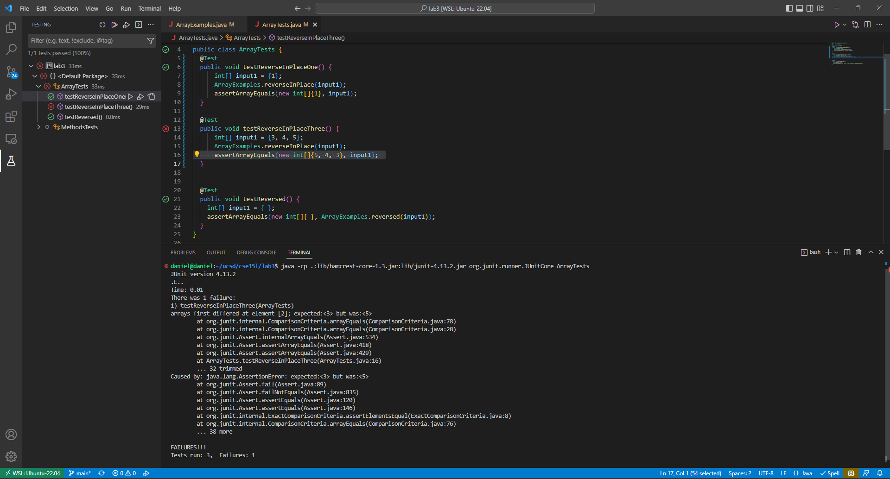

# CSE 15L, LAB 2

## Part 1

### StringServer.java Code
```java
import java.io.IOException;
import java.net.URI;

class StringHandler implements URLHandler {
    // all the messages that the Server will remember (in-memory)
    String message = "";

    public String handleRequest(URI url) {
        String path = url.getPath();
        
        if (url.getQuery() == null) {
            return message;
        }

        String[] parameters = url.getQuery().split("=");

        // add-message path
        if (path.contains("/add-message")) {
            // first parameter for the query type, second as the actual string to add
            if (parameters.length == 2 && parameters[0].equals("s")) {
                message += parameters[1] + "\n";
                return message;
            }
            return "400 Bad Request";
        }
        return "404 Not Found";
    }
}

class StringServer {
    public static void main(String[] args) throws IOException {
        if (args.length == 0) {
            System.out.println("Missing port number! Try any number between 1024 to 49151");
            return;
        }

        int port = Integer.parseInt(args[0]);

        Server.start(port, new StringHandler());
    }
}
```
### StringServer Website Screenshot 1 


> Which methods in your code are called?

- The `handleRequest` method from the `StringHandler` class is called when the user sends a request to the `StringServer`. Within the method,
    - the `getPath` instance method of the `url` URI object is called to later check if the `/add-message` path is being hit.
    - the `getQuery` instance method of the `url` URI object is called to check if a query is being passed in and parse any query parameters for later use in adding a new message.

> What are the relevant arguments to those methods, and the values of any relevant fields of the class?

- `handleRequest`: 
    - Relevant argument: the `URI` object of the client request to `StringHandler`
    - Relevant fields & values:
        - `message`: String containing all the messages added via request, modified given that the `url` URI parameter is considered a valid request by following code. Value: `"Daniel\n"`

- `getPath`: 
    - Relevant argument: N/a
    - Relevant values: 
        - `message`: String containing all the messages added via request, modified given that the path contains `/add-message`. Value: `"Daniel\n"`

- `getQuery`: 
    - Relevant argument: N/a
    - Relevant values: 
        - `message`: String containing all the messages added via request, modified given that the query is `split` with delimiter `=` into two elements and the first element being the character `s`. Value: `"Daniel\n"`

> How do the values of any relevant fields of the class change from this specific request? If no values got changed, explain why.

The `message` variable of the `StringHandler` is modified from `""` to `"Daniel\n"`. 


### StringServer Website Screenshot 2 

> Which methods in your code are called?

- The `handleRequest` method from the `StringHandler` class is called when the user sends a request to the `StringServer`. Within the method,
    - the `getPath` instance method of the `url` URI object is called to later check if the `/add-message` path is being hit.
    - the `getQuery` instance method of the `url` URI object is called to check if a query is being passed in and parse any query parameters for later use in adding a new message.

> What are the relevant arguments to those methods, and the values of any relevant fields of the class?

- `handleRequest`: 
    - Relevant argument: the `URI` object of the client request to `StringHandler`
    - Relevant fields & values:
        - `message`: String containing all the messages added via request, modified given that the `url` URI parameter is considered a valid request by following code. Value: `"Daniel\nPeter\n"`

- `getPath`: 
    - Relevant argument: N/a
    - Relevant values: 
        - `message`: String containing all the messages added via request, modified given that the path contains `/add-message`. Value: `"Daniel\nPeter\n"`

- `getQuery`: 
    - Relevant argument: N/a
    - Relevant values: 
        - `message`: String containing all the messages added via request, modified given that the query is `split` with delimiter `=` into two elements and the first element being the character `s`. Value: `"Daniel\nPeter\n"`

> How do the values of any relevant fields of the class change from this specific request? If no values got changed, explain why.

The `message` variable of the `StringHandler` is modified from `"Daniel\n"` to `"Daniel\nPeter\n"`. 

## Part 2

### Bug in `reverseInPlace` method from `ArrayExamples.java`

> A failure-inducing input for the buggy program, as a JUnit test and any associated code
```java
@Test
public void testReverseInPlaceThree() {
    int[] input1 = {3, 4, 5};
    ArrayExamples.reverseInPlace(input1);
    assertArrayEquals(new int[]{5, 4, 3}, input1); 
}
```

> An input that doesn’t induce a failure, as a JUnit test and any associated code

```java
@Test
public void testReverseInPlaceOne() {
    int[] input1 = {1};
    ArrayExamples.reverseInPlace(input1);
    assertArrayEquals(new int[]{1}, input1); 
}
```

> The symptom, as the output of running the tests



> The bug, as the before-and-after code change required to fix it

Before:
```java
static void reverseInPlace(int[] arr) {
    for (int i = 0; i < arr.length; i += 1) {
        arr[i] = arr[arr.length - i - 1];
    }
}
```

After: 
```java
static void reverseInPlace(int[] arr) {
    for (int i = 0; i < arr.length / 2; i += 1) {
        int temp = arr[i];
        arr[i] = arr[arr.length - i - 1];
        arr[arr.length - i - 1] = temp;
    }
}
```

## Part 3

> In a couple of sentences, describe something you learned from lab in week 2 or 3 that you didn’t know before.

I learned about JUnit testing and its whole ecosystem of testing programs and ensuring they run properly. The `assertEquals` and similar methods JUnit provided were interesting to use and I could see the use for such tester files at the large scale that would systematically ensure the correctness of large amounts of code. Although it was a great way to learn JUnit tests by running them against trivial methods, it does seem a bit unnecessary to write such tests for code in practice. 