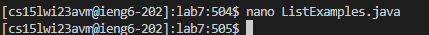

# CSE 15L Lab Report 4
### Daniel Ji, A17383785

## Log into ieng6
Keys pressed: 
```
<ctrl> + r
ssh
<enter>
``` 

I knew that the `ssh cs15lwi23avm@ieng6.ucsd.edu` was the last `ssh` command run in recent history, so I reverse searched it and hit enter. 


## Clone your fork of the repository from your Github account
Keys pressed: 
```
<ctrl> + r
git clone
<enter>
``` 

I knew that the `git clone git@github.com:daniel-ji/lab7.git` was the last `git clone` command run in recent history, so I reverse searched it and hit enter. 


## Run the tests, demonstrating that they fail

Keys pressed:
```
cd lab7
<enter>

<ctrl> + r
java
<ctrl> + r
<enter>

<ctrl> + r
java
<ctrl> + r
<enter>

```

First, I had to enter the lab7 folder I just cloned, so I type out the command and hit enter. 

To run the tests, I had to first compile them, so I reverse searched the last `java` command and hit enter. It displayed `java -cp .:lib/hamcrest-core-1.3.jar:lib/junit-4.13.2.jar org.junit.runner.JUnitCore ListExamplesTests` instead of `javac -cp .:lib/hamcrest-core-1.3.jar:lib/junit-4.13.2.jar *.java`, so I `<ctrl> + r`'d one more time to get the correct command. 

To actually run them, I reverse searched the last `java` command and hit enter. It displayed `javac -cp .:lib/hamcrest-core-1.3.jar:lib/junit-4.13.2.jar *.java` instead of `java -cp .:lib/hamcrest-core-1.3.jar:lib/junit-4.13.2.jar org.junit.runner.JUnitCore ListExamplesTests`, (because I just ran the former command) so I `<ctrl> + r`'d one more time to get the correct command. 


## Edit the code file to fix the failing test

Keys pressed:
```
nano ListExamples.java
<enter>
<ctrl> + / 
43
<enter>
<right arrow> * 12
<backspace>
2
<ctrl> + O
<enter>
<ctrl> + X
```

To fix the bug in the `ListExamples.java` file, I used the `nano` editor. I used `<ctrl> + /` to go to line number 43, and then used `<right arrow>` 12 times to move the cursor to the end of `index1`. I then used `<backspace>` to delete the `1` and replaced it with `2`. I then used `<ctrl> + O` to save the file, and `<ctrl> + X` to exit the editor.

Command line screenshot: 


Nano screenshot:


## Run the tests, demonstrating that they now succeed

Keys pressed:
```
<up><up><up>
<enter>
<up><up><up>
<enter>
```

To rerun the tests, I used `<up>` three times to recompile the source and test files, going to the command `javac -cp .:lib/hamcrest-core-1.3.jar:lib/junit-4.13.2.jar *.java`, and then hit enter. To run the tests, I used `<up>` three times, going to the command `java -cp .:lib/hamcrest-core-1.3.jar:lib/junit-4.13.2.jar org.junit.runner.JUnitCore ListExamplesTests`, and then hit enter.


## Commit and push the resulting change to your Github account (you can pick any commit message!)

Keys pressed:
```
git add . 
<enter>
git commit -m "fix bug"
<enter>
git push
<enter>
```

To commit the changes, I used `git add .` to add all the files in the current directory to the staging area, hit enter, and then used `git commit -m "fix bug"` to commit the changes with the message "fix bug", and hit enter again. To push the changes to my Github account, I used `git push` to push the changes to the remote repository, and hit enter.

